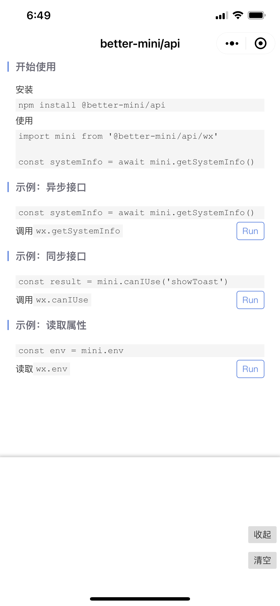

# `@better-mini/api`

小程序 API 接口 promisify 代理，支持异步接口的 `async/await` 调用。

## 使用

安装

```
npm install @better-mini/api
```

### 微信端使用

```js
// page.js
import mini from '@better-mini/api/lib/wx'

Page({
  async onLoad() {
    const systemInfo = await mini.getSystemInfo() // 接口调用
    console.log(systemInfo)
  },
})
```

### 支付宝端使用

```js
// page.js
import mini from '@better-mini/api/lib/my'

Page({
  async onLoad() {
    const systemInfo = await mini.getSystemInfo() // 接口调用
    console.log(systemInfo)
  },
})
```

### 其他端使用

```js
// page.js
import { createApiProxy } from '@better-mini/api/lib/api-proxy'

const mini = createApiProxy({ swan }) // 封装百度小程序接口

Page({
  async onLoad() {
    const systemInfo = await mini.getSystemInfo() // 接口调用
    console.log(systemInfo)
  },
})
```

### 平台支持

| 平台     | 支持情况 | 说明                                                      |
| -------- | -------- | --------------------------------------------------------- |
| 微信     | 支持     | 引入 `@better-mini/api/lib/wx` 直接使用                   |
| 支付宝   | 支持     | 引入 `@better-mini/api/lib/my` 直接使用。也支持淘宝、千牛 |
| 百度     | 理论支持 | 需通过 `createApiProxy` 支持                              |
| 字节     | 理论支持 | 需通过 `createApiProxy` 支持                              |
| QQ       | 理论支持 | 需通过 `createApiProxy` 支持                              |
| 京东     | 理论支持 | 需通过 `createApiProxy` 支持                              |
| 企业微信 | 理论支持 | 需通过 `createApiProxy` 支持                              |
| 钉钉     | 理论支持 | 需通过 `createApiProxy` 支持                              |

### API

#### createApiProxy(target, [options] )

基于此接口可以封装任何小程序平台的 api 接口。

| 参数                 | 可选 | 类型                        | 释义                                                                                |
| -------------------- | ---- | --------------------------- | ----------------------------------------------------------------------------------- | ----------------------------- |
| `target`             | 否   | `{ [key: string]: object }` | 需要封装的 API 对象，微信平台为 `{ wx }`，支付宝平台为 `{ my }`，以此类推。         |
| `options`            | 是   |                             | 配置选项，用于指定同步接口检测正则、同步接口列表、属性列表。                        |
| `options.syncPreset` | 是   | `RegExp[]`                  | 同步接口检测正则，如 `/[a-z]Sync$/` 检测 `wx.getSystemInfoSync`。类似的还有：`/^(on | off)[A-Z]/`、`/^create[A-Z]/` |
| `options.syncApis`   | 是   | `string[]`                  | 同步接口列表，如 `base64ToArrayBuffer`                                              |
| `options.props`      | 是   | `string[]`                  | 属性列表，如 `env`                                                                  |

使用

```js
import { createApiProxy } from '@better-mini/api/lib/api-proxy'

const mini = createApiProxy({ wx }) // 仅支持异步接口，不支持同步接口调用和属性读取

const options = {
  syncPreset: [/[a-z]Sync$/, /^(on|off)[A-Z]/, /^create[A-Z]/],
  syncApis: ['canIUse'],
  props: ['env'],
}
const mini = createApiProxy({ wx }, options) // 支持异步接口，也可配置支持同步接口调用和属性读取
```

### 同步接口调用和属性读取

```js
import mini from '@better-mini/api/lib/wx'

const systemInfo = mini.getSystemInfoSync() // 同步接口调用

console.log(mini.env) // 属性读取
```

虽然 `@better-mini/api` 支持同步接口调用和属性读取，但是考虑到多使用一个类库，就会增加一项潜在的 bug 因素，因此我们推荐使用原生方式进行同步接口调用和属性读取。

## 示例



## TODO

[ ] 测试用例完善
[ ] Typescript 类型声明

_目前 typescript 类型声明为 `any`，虽然支持在 typescript 中使用，但是缺少代码补全提示和类型检查。没有书写详细的接口类型声明是因为目前尚未有快速修改小程序原生接口类型声明的方案，逐个修改工作量太大。_

## Contributing

你可以：

- 完善 TODO 中的工作
- 增加对其他平台的支持
- 完善文档和示例
