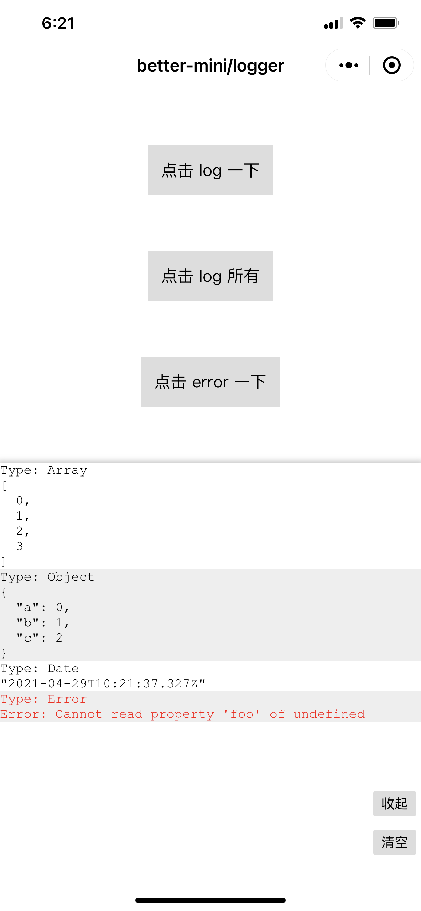

# @better-mini/logger

小程序真机调试/预览 Logger 组件，支持输出日志到屏幕进行查看，提升调试效率。

_注：目前仅支持 Taro 3.0_



## 使用

安装

```
npm install @better-mini/logger
```

使用

```jsx
import React from 'react'
import Logger from '@better-mini/logger'

import '@better-mini/logger/dist/index.less'

const Page = () => {
  const handleLog = () => {
    Logger.log('Hello')
  }

  const handleError = () => {
    Logger.error('Ops, an error occurred.')
  }

  return (
    <View className={styles.page}>
      <View className={styles.btn} onClick={handleLog}>
        点击 log 一下
      </View>
      <View className={styles.btn} onClick={handleError}>
        点击 error 一下
      </View>
      <Logger visible beautify max={100} height={600} />
    </View>
  )
}
```

## API

### Logger 组件

`Logger` 继承至 `View`，因此 `View` 的 `className` `style` 等 prop 均支持

| 属性       | 可选 | 类型      | 默认值 | 释义                                       |
| ---------- | ---- | --------- | ------ | ------------------------------------------ |
| `visible`  | 是   | `boolean` | `true` | 是否渲染                                   |
| `expand`   | 是   | `boolean` | `true` | 是否展开                                   |
| `beautify` | 是   | `boolean` | `true` | 是否格式化 JSON 数据，便于阅读             |
| `max`      | 是   | `number`  | `30`   | 最多展示多少日志，超过时最早的日志会被删除 |
| `height`   | 是   | `number`  | `400`  | 组件高度                                   |

### Logger.log(arg1 [, arg2, ..., argN])

输出普通日志

参数：`arg1 [, arg2, ..., argN]` ：`any`

### Logger.error(arg1 [, arg2, ..., argN])

输出错误日志

参数：`arg1 [, arg2, ..., argN]` ：`any`
